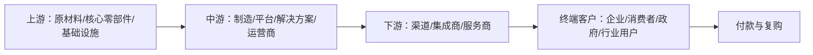

# 行业研究报告模板

Use this template for full Chinese industry research reports. Adapt section depth to the target industry and available evidence. Do not invent missing data.

## Template Map

- 1. 核心结论
- 2. 行业定义
- 3. 市场规模
- 4. 产业链分析
- 5. 商业模式
- 6. 需求分析
- 7. 竞争格局
- 8. 护城河分析
- 9. 财务与经营指标
- 10. 趋势与风险
- 11. 机会判断
- 12. 结论与建议

# 行业研究报告：{XXX行业}

## 1. 核心结论

- 这个行业是否值得关注？
- 最大机会在哪里？
- 最大风险是什么？
- 谁最有可能胜出？
- 研究范围、关键假设与数据置信度。

## 2. 行业定义

- 行业边界：包含什么，不包含什么。
- 产品/服务类型：核心产品、增值服务、交付形态。
- 目标客户：用户、付款方、决策方。
- 解决什么问题：客户痛点与替代方案。
- 替代方案：直接替代、间接替代、低成本替代、自建方案。

## 3. 市场规模

- 当前市场规模：年份、地区、口径、货币单位。
- 未来增长预测：3-5年空间、CAGR、关键假设。
- TAM / SAM / SOM：分别说明口径。
- 核心测算逻辑：
  - 目标客户数量 x 渗透率 x 客单价 x 购买频次。
  - 如适用，补充装机量、保有量、复购率、使用频次、ARPU、交易额、take rate 等行业指标。
- 数据质量：公开数据、估算数据、缺口与置信度。

## 4. 产业链分析

Include a value chain diagram. Example:

- 上游：关键资源、供应商、成本占比、供应风险。
- 中游：核心环节、技术/运营能力、利润池。
- 下游：渠道、客户触达、交付和服务。
- 钱从哪里来、流向哪里：收入、成本、分成、补贴、金融工具。
- 利润分布：谁最赚钱，为什么。
- 议价能力：谁掌握稀缺资源，谁承压。

## 5. 商业模式

- 收入来源：一次性销售、订阅、服务费、交易佣金、租赁、广告、金融、数据、增值服务等。
- 收费方式：定价口径、合同周期、付费节点。
- 成本结构：固定成本、变动成本、获客成本、履约成本、研发、渠道、售后、库存、资金成本。
- 毛利率：当前水平、影响因素、同业对比。
- 回本周期：客户回本、设备回本、门店/项目回本、销售回款周期。
- 现金流特点：预收/赊销、库存、应收账款、资本开支。
- 可持续性：复购、续费、客户粘性、规模效应、利润率是否随规模改善。

## 6. 需求分析

- 用户画像：谁在使用，场景是什么。
- 付款方：谁付钱，预算来自哪里。
- 决策方：采购链条、审批周期、关键影响者。
- 核心痛点：效率、成本、安全、合规、体验、收入增长、风险控制。
- 购买触发：政策、事故、成本下降、技术成熟、竞争压力、替换周期。
- 付费意愿：ROI、替代成本、价格敏感度。
- 需求弹性：刚需/可选、周期性、区域差异。

## 7. 竞争格局

- 主要玩家：头部公司、区域玩家、新进入者、跨界玩家。
- 竞争对手分类：直接竞争、间接替代、潜在进入者。
- 市场份额：公开份额、估算范围、份额口径。
- 各家公司优劣势：产品、技术、成本、渠道、品牌、资金、资质、生态。
- 竞争维度：价格、产品性能、交付能力、渠道覆盖、服务、数据、合规、资本。
- 竞争强度：集中度、价格战、差异化程度、进入/退出壁垒。

Suggested competitor table:

| 公司/类型 | 定位 | 主要客户 | 核心优势 | 主要短板 | 份额/规模 | 备注 |
| --- | --- | --- | --- | --- | --- | --- |
| {公司A} | {定位} | {客户} | {优势} | {短板} | {份额} | {备注} |

## 8. 护城河分析

- 技术壁垒：专利、算法、工艺、系统集成、可靠性。
- 成本壁垒：规模采购、生产效率、资产利用率、低成本资金。
- 渠道壁垒：经销网络、KA客户、区域覆盖、服务网络。
- 数据壁垒：数据规模、质量、闭环、合规授权。
- 品牌壁垒：信任、安全背书、行业口碑。
- 生态壁垒：平台网络、开发者、合作伙伴、互补产品。
- 资质壁垒：牌照、认证、标准、监管准入。
- 壁垒判断：是真壁垒、阶段性壁垒，还是容易被资本/价格/技术追平。

## 9. 财务与经营指标

- 收入：规模、增长、收入结构。
- 毛利率：行业区间、驱动因素。
- 净利率：销售、研发、管理、财务费用影响。
- 现金流：回款、库存、应收账款、资本开支。
- 回本周期：客户、项目、设备、门店或平台侧回本。
- 复购率/留存率：续费、替换、使用频次。
- 行业特定指标：ARPU、CAC、LTV、take rate、利用率、良率、装机量、客座率、坪效等。

## 10. 趋势与风险

### PEST趋势

| 维度 | 含义 | 对本行业的影响 |
| --- | --- | --- |
| P 政策 | 监管、补贴、标准、合规 | {影响} |
| E 经济 | 利率、汇率、消费能力、融资成本 | {影响} |
| S 社会 | 用户习惯、人口结构、城市化、劳动力 | {影响} |
| T 技术 | 新技术替代、自动化、AI、材料/工艺进步 | {影响} |

### 主要风险

| 风险 | 典型表现 | 影响 | 缓释方式 |
| --- | --- | --- | --- |
| 政策风险 | 监管收紧、补贴取消、认证变化 | {影响} | {缓释} |
| 技术风险 | 新技术替代旧方案 | {影响} | {缓释} |
| 价格风险 | 竞争加剧导致降价 | {影响} | {缓释} |
| 供应链风险 | 关键零部件涨价或断供 | {影响} | {缓释} |
| 安全风险 | 起火、事故、数据泄露、合规事故 | {影响} | {缓释} |
| 现金流风险 | 回款慢、库存高、资本开支大 | {影响} | {缓释} |
| 海外风险 | 汇率、认证、当地法规、地缘政治 | {影响} | {缓释} |

### 未来3-5年趋势

- 政策趋势。
- 技术趋势。
- 需求趋势。
- 价格趋势。
- 渠道与商业模式趋势。

## 11. 机会判断

- 进入机会：什么切入点最现实。
- 投资机会：哪些环节、公司类型或资产值得关注。
- 产品机会：哪些功能、服务、套餐、解决方案有空白。
- 区域机会：哪些国家、城市、渠道或细分场景更优。
- 并购机会：可整合的技术、渠道、客户、产能或牌照。
- 胜出条件：赢家需要具备什么能力组合。

## 12. 结论与建议

- 是否进入/关注/投资？
- 如何进入：先做哪个细分、先服务谁、先验证什么假设。
- 先做什么：数据验证、客户访谈、渠道测试、样板项目、财务模型、竞品拆解。
- 避免什么：高风险区域、低毛利价格战、重资产陷阱、监管灰区、不可持续补贴。
- 下一步研究清单：还需要补哪些数据或访谈。
